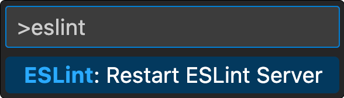

# eslint-plugin-export-scope

Disallows importing scoped exports outside their scope.


## Usage Example

| @scope path | restrict export to the ↓dir↓ and all subdirs                                   |
| ----------- | ------------------------------------------------------------------------------ |
| .           | current directory (default in the [Strict Mode](<#strict-mode-(recommended)>)) |
| ..          | parent directory                                                               |
| ../..       | two directories above                                                          |
| \*          | global export                                                                  |

```ts
// 👇 Applies to all exports in the file unless overriden with a local @scope
/** @scope default .. */

/** @scope * */
export const helper1 = ""; // 👈 Available everywhere

export const helper2 = ""; // 👈 infers scope from `@scope default`

/** @scope ../.. */
export default "";
```

Any type of comment / JSDoc can be used. Only JSDoc offers syntax highlighting in VSCode.

```ts
// @scope .
/* @scope . */
/** @scope . */
export default "";
```

⚠️ To re-lint imports in VSCode after updating `@scope` declarations ESLint Server needs to be restarted [(ESLint limitation)](https://github.com/microsoft/vscode-eslint/issues/1565#event-7958473201).

<div style="margin: auto; max-width: 200px;">
  
</div>

## Strict Mode (Recommended)

You can activate the Strict Mode by setting `strictMode` to `true` in both `tsconfig.json` and `.eslintrc.*`.

Strict Mode restricts all exports to the export directory (and subdirectories) by default. `index` files are accessible one level above the export directory. Default behaviour can be overriden with `@scope` properties.

## Path Tags

Default export scope can also be declared by adding `@` to folder/file names:

| path                             | accessibility                                                   |
| -------------------------------- | --------------------------------------------------------------- |
| `src/@common/utils.ts`           | exports within `@common` will be global unless overriden        |
| `src/@utils.ts`                  | exports within `@utils.ts` file will be global unless overriden |
| `src/sub1/sub2/@..sub3/file.ts`  | exports within `@..sub3` will be available from `sub2`          |
| `src/sub1/sub2/@...sub3/file.ts` | exports within `@...sub3` will be available from `sub1`         |

## Installation

Install [ESLint](https://eslint.org/) and the ESLint/TS plugin:

```sh
npm i -D eslint eslint-plugin-export-scope
```

#### ESLint plugin:

Add ESLint plugin to your `.eslintrc.js` configuration file.

##### .eslintrc.js

```json
"overrides": [{
  "files": ["*.js", "*.mjs", "*.jsx", "*.ts", "*.mts", "*.tsx"],
  "parser": "@typescript-eslint/parser",
  "parserOptions": { "project": "tsconfig.json" },
  "plugins": ["export-scope"],
  "rules": {
    "export-scope/no-imports-outside-export-scope": [
      "error",
      { "strictMode": false }
    ]
  }
}]
```

#### TS plugin:

Add TypeScript plugin to your `tsconfig.json`. This will hide inaccessible exports from VSCode autocomplete suggestions.

##### tsconfig.json

```json
"compilerOptions": {
  "plugins": [
    { "name": "eslint-plugin-export-scope", "strictMode": false }
  ],
},
"include": ["**/*"],
```

Tell VSCode to `Use Workspace Version` of TypeScript. Otherwise TS plugin won't work.

<div style="margin: auto; max-width: 600px;">
  
</div>
