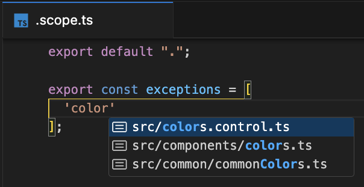
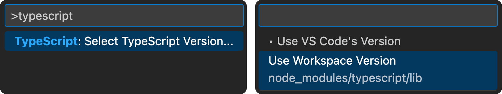
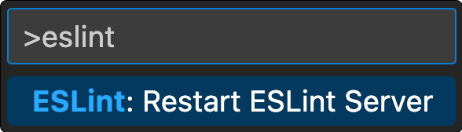

# eslint-plugin-export-scope

Don't leak **LOCAL** utils, states, contexts, components into the global scope.


## Demo


## Scopes

<p align="center">

| scope           | importable from                         |                               |
| --------------- | --------------------------------------- | ----------------------------- |
| .               | current directory and children          | default for all exports       |
| ..              | parent directory and children           | default for **`index`** files |
| ../..           | two directories above and children      |                               |
| src/consumer    | within specified directory and children |                               |
| src/consumer.ts | within specified file                   |                               |
| \*              | anywhere                                |                               |

</p>

## Scoped Exports

```ts
/** @scopeDefault ../.. */
/** ☝ Applies to all exports in the file unless overriden with a local `@scope` */

/** @scope * */
export const helper1 = ""; // 👈 Available everywhere

export const helper2 = ""; // 👈 inherits scope `../..` from `@scopeDefault`

/** @scope src/components */
export default "";
```

```ts
/** @scope .. */
const helper3 = "";

export { helper3 }; // 👈 inherits the scope from the variable declaration
```

## Default folder scope with `.scope.ts` files

<p align="center">

</p>

```ts
└── src
  └── `common`
    ├── utils.ts
    ├── context.ts
    └── `.scope.ts`
             │
             │
  ╭────────────────────╮
  │ export default '*' │
  ╰────────────────────╯
// ⬆ this will make all exports within `common`
// importable from anywhere unless a
// specific export is overriden on a lower level

```

### Exceptions

#### Export scope exceptions

```ts
// schema.ts
/**
 * @scope ..
 * @scopeException src/schemaConsumer 👈 whole folder has access
 * @scopeException src/schemaConsumer/index.ts 👈 whole file has access
 */
export default "";
```

#### Folder scope exceptions in `.scope.ts` files

```ts
└── src
  └── `generated`
    ├── schema.ts
    └── `.scope.ts`
             │
             │
  ╭──────────────────────────────────╮
  │ export default '.';              │
  │                                  │
  │ export const exceptions = [      │
  │   'src/schemaConsumer',          │
  │   'src/scripts/schemaParser.ts', │
  │ ]                                │
  ╰──────────────────────────────────╯
// ⬆ by default exports are only importable
// within `generated` folder, but
// folders/files in `exceptions` are exempt.

```

## Default scope with `.scope.default.ts` files

- `.scope.ts` sets a default scope for all exports from the current directory
- `.scope.default.ts` sets a default scope for the current directory **AND** all subdirectories

## Installation

Install [ESLint](https://eslint.org/) and the `export-scope` package. This package includes both an `ESLint` plugin (validates imports) and a `TS Language Server` plugin (manages autocompletion).

### ESLint plugin (ESLint 9 / 10, Flat Config)

```sh
npm i -D eslint typescript-eslint eslint-plugin-export-scope
```

```json
// package.json
{
  "type": "module"
}
```

```js
// eslint.config.js
import tseslint from "typescript-eslint";
import exportScope from "eslint-plugin-export-scope";

export default tseslint.config(
  // other configs,
  exportScope.configs.flatConfigRecommended,
);
```

<details>
  <summary>Custom parser (Optional)</summary>

```js
  // This plugin already comes with a parser. If you want a local one:
  {
    files: ['**/*.{ts,tsx,js,jsx,mts,mjs,cts,cjs}'],
    languageOptions: { parser: /* local parser */ },
  },
```

</details>

### ESLint plugin (ESLint 8, Legacy Config)

<details>
  <summary>Instructions</summary>

```sh
npm i -D eslint eslint-plugin-export-scope
```

```js
// .eslintrc.js
module.exports = {
  extends: ["plugin:export-scope/recommended"],
  parserOptions: { project: true, tsconfigRootDir: __dirname },
};

// This plugin already comes with a parser. If you want a local one:
  parser: /* local parser */,
```

</details>

### TS plugin

```js
// tsconfig.json
"compilerOptions": {
  "plugins": [{ "name": "eslint-plugin-export-scope" }],
},
```

⚠️ Tell VSCode to `Use Workspace Version` of TypeScript. Otherwise TS plugin won't work.

<p align="center">
  
</p>

## Pure JS projects

`tsconfig.json` with `compilerOptions.allowJs` set to `true` is required

## Upgrading

<details>
  <summary>v2 => v3 (Optional)</summary>

- Including `"**/.scope.*"` in `tsconfig.js` is no longer required
- Eslint config could be simplified by following the updated [instructions](#installation)
</details>

<details>
  <summary>v1 => v2</summary>

- Replace all `//` comments with jsDocs `/** */`
- Replace `@scope default` with `@scopeDefault`
- Relace `@..` file/folder prefixes with `.scope.ts` files.
- Make sure `.eslintrc.js` and `tsconfig.json` configs are updated
</details>

## Hints

- Type `@` above exports for automatic jsDoc generation.
- Use autocompletion provided within jsDocs and `.scope.ts` files.
- Root `.scope.default.ts` could be used to set the default for the whole project. Having `export default '*'` there would make all exports global by default in case you prefer a less strict approach.

## Issues

⚠️ To re-lint an import in VSCode after updating a `scope` declaration either `touch` this import or restart the ESLint Server [(ESLint limitation)](https://github.com/microsoft/vscode-eslint/issues/1565#event-7958473201).

<p align="center">
  
</p>
