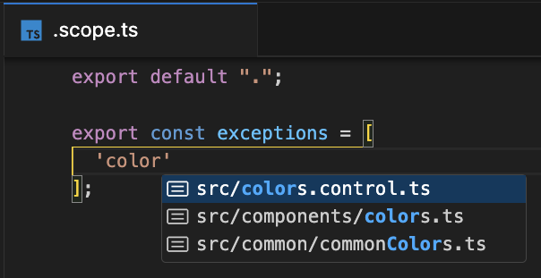
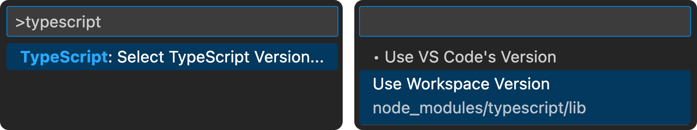

# eslint-plugin-export-scope

Set export scope (importability) for local utils, states, contexts, components, e.t.c. They should only be visible/accessible within their local scope.


## Demo


## Scopes

<p align="center">

| scope           | importable from                         |                               |
| --------------- | --------------------------------------- | ----------------------------- |
| .               | current directory and children          | default for all exports       |
| ..              | parent directory and children           | default for **`index`** files |
| ../..           | two directories above and children      |                               |
| src/consumer    | within specified directory and children |                               |
| src/consumer.ts | within specified file                   |                               |
| \*              | anywhere                                |                               |

</p>

## Scoped Exports

```ts
/** @scopeDefault ../.. */
/** ☝ Applies to all exports in the file unless overriden with a local `@scope` */

/** @scope * */
export const helper1 = ""; // 👈 Available everywhere

export const helper2 = ""; // 👈 inherits scope `../..` from `@scopeDefault`

/** @scope src/components */
export default "";
```

## Default folder scope with `.scope.ts` files

<p align="center">

</p>

```ts
└── src
  └── `common`
    ├── utils.ts
    ├── context.ts
    └── `.scope.ts`
             │
             │
  ╭────────────────────╮
  │ export default '*' │
  ╰────────────────────╯
// ⬆ this will make all exports within `common`
// importable from anywhere unless a
// specific export is overriden on a lower level

```

### Exceptions

#### Export scope exceptions

```ts
// schema.ts
/**
 * @scope ..
 * @scopeException src/schemaConsumer 👈 whole folder has access
 * @scopeException src/schemaConsumer/index.ts 👈 whole file has access
 */
export default "";
```

#### Folder scope exceptions in `.scope.ts` files

```ts
└── src
  └── `generated`
    ├── schema.ts
    └── `.scope.ts`
             │
             │
  ╭──────────────────────────────────╮
  │ export default '.';              │
  │                                  │
  │ export const exceptions = [      │
  │   'src/schemaConsumer',          │
  │   'src/scripts/schemaParser.ts', │
  │ ]                                │
  ╰──────────────────────────────────╯
// ⬆ by default exports are only importable
// within `generated` folder, but
// folders/files in `exceptions` are exempt.

```

## Issues

⚠️ To re-lint an import in VSCode after updating a `scope` declaration either `touch` this import or restart the ESLint Server [(ESLint limitation)](https://github.com/microsoft/vscode-eslint/issues/1565#event-7958473201).

<p align="center">
  
</p>

## Installation

Install [ESLint](https://eslint.org/) and the `export-scope` package. This package includes both an `ESLint` plugin and a `TS Language Server` plugin.

```sh
npm i -D eslint eslint-plugin-export-scope
```

#### ESLint plugin will highlight imports outside the scope

```js
// .eslintrc.js
module.exports = {
  // ...
  ignorePatterns: ["!.scope.ts"],
  overrides: [
    {
      files: ["*.js", "*.mjs", "*.jsx", "*.ts", "*.mts", "*.tsx"],
      parser: "@typescript-eslint/parser",
      parserOptions: { project: true, tsconfigRootDir: __dirname },
      plugins: ["export-scope"],
      rules: { "export-scope/no-imports-outside-export-scope": "error" },
    },
  ],
};
```

#### TS plugin will disable autocompletion for exports outside the scope

```json
// tsconfig.json
"compilerOptions": {
  "plugins": [{ "name": "eslint-plugin-export-scope" }],
},
"include": ["**/*", "**/.scope.ts"]
```

Tell VSCode to `Use Workspace Version` of TypeScript. Otherwise TS plugin won't work.

<p align="center">
  
</p>

## Hints

- Type `@` above exports for automatic jsDoc generation.
- Use autocompletion provided within jsDocs and `.scope.ts` files.
- Creating an `export default '*'` `.scope.ts` file in the root of the project will make all exports global by default if you prefer a less strict approach.
